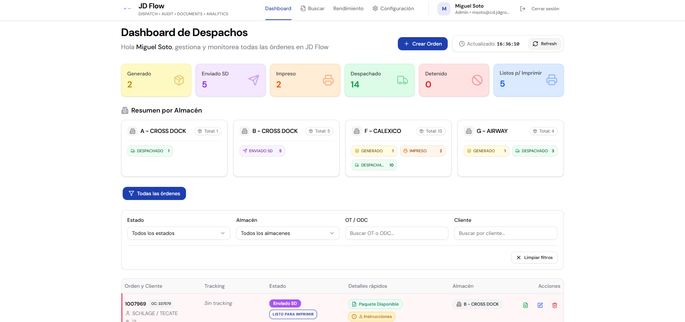
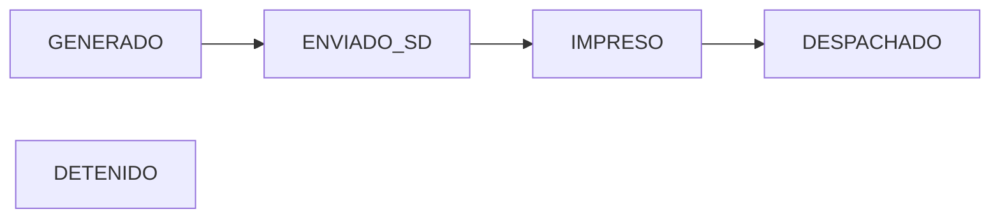
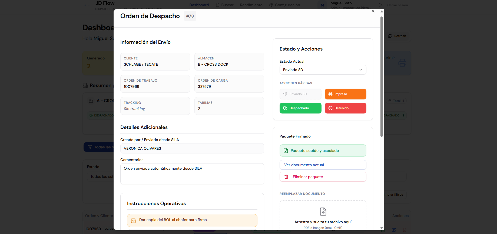
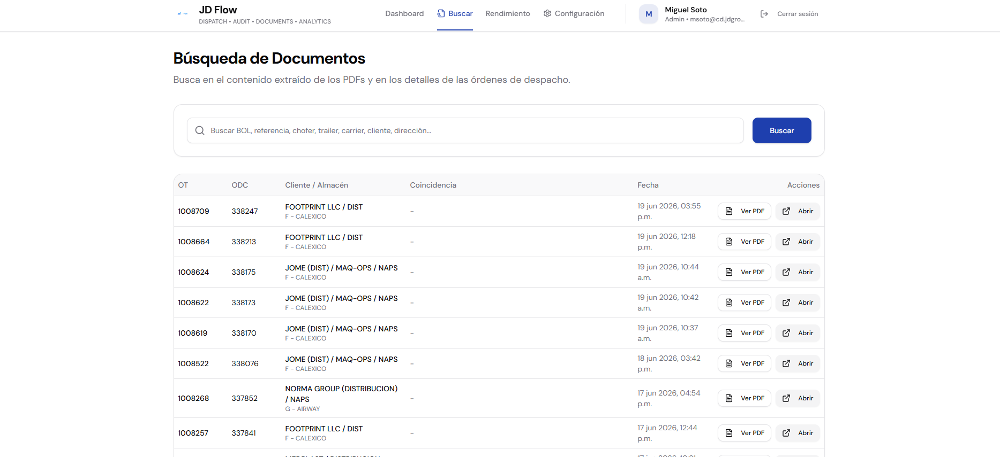
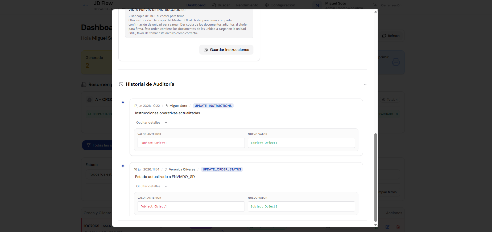
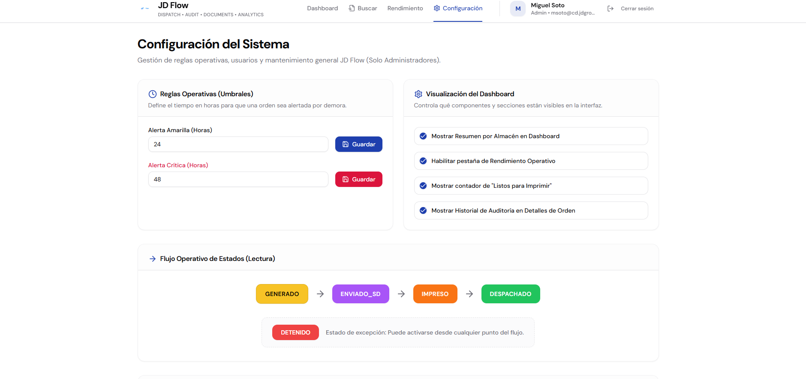

  

# JD Flow

  <strong>Dispatch • Audit • Documents • Analytics</strong>

  Operational Dispatch Management Platform for Warehouse & Distribution Teams

---

# Overview

JD Flow is an operational dispatch platform designed to streamline warehouse-to-distribution workflows.

The system centralizes dispatch orders generated from SILA, provides document management, signed package tracking, operational visibility, audit history, OCR-powered document search, and performance analytics in a single interface.

Built to reduce manual communication, eliminate email dependencies, improve traceability, and increase operational efficiency across multiple warehouse locations.

---

# Dashboard

The main dashboard provides real-time operational visibility across all warehouses.

### Features

- Real-time order monitoring
- Status distribution
- Warehouse summaries
- Quick operational filtering
- Print queue visibility
- Dispatch workload tracking

---

# Dispatch Workflow

JD Flow follows a standardized operational flow:

### Status Definitions

| Status | Description |
|----------|----------|
| GENERADO | Order created and waiting for dispatch review |
| ENVIADO_SD | Sent to San Diego operation |
| IMPRESO | Documentation printed and ready |
| DESPACHADO | Shipment completed |
| DETENIDO | Operational exception requiring attention |

---

# Dispatch Order Management

Each order contains all operational information required by warehouse and distribution teams.

### Included Information

- Customer
- Warehouse
- Work Order (OT)
- Load Order (ODC)
- Tracking Number
- Pallet Count
- Operational Instructions
- Comments
- Signed Documents
- Audit History

---

# Signed Package Management

JD Flow allows dispatch teams to associate signed shipping packages directly with an order.

### Supported Functions

- Upload signed package
- Replace package
- View package
- Download package
- Delete package
- Automatic status updates

Benefits:

- Centralized documentation
- Reduced email dependency
- Faster customer support response
- Improved traceability

---

# OCR Document Search

One of the most powerful features of JD Flow.

The system indexes uploaded documents and extracts searchable text from PDFs.

Users can search by:

- BOL
- Reference Number
- Customer
- Carrier
- Driver
- Trailer
- Address
- Order Number
- OCR-extracted document content

This dramatically reduces document retrieval times.

---

# Audit Trail

Every significant action is logged.

### Audited Events

- Status Changes
- Document Uploads
- Document Replacements
- Instruction Updates
- User Actions
- Order Modifications

Benefits:

- Accountability
- Compliance
- Operational Transparency
- Root Cause Analysis

---

# System Configuration

Administrative users can control operational rules and dashboard visibility.

### Configurable Parameters

- Alert thresholds
- Dashboard widgets
- Audit visibility
- Performance modules
- Operational settings

---

# Multi-Warehouse Support

Designed for operations managing multiple warehouse locations.

Current warehouse structure:

- A - Cross Dock
- B - Cross Dock
- F - Calexico
- G - Airway

The dashboard automatically groups operational metrics by warehouse.

---

# Role-Based Access Control

JD Flow supports multiple operational roles.

| Role | Access |
|--------|--------|
| Admin | Full Access |
| Tijuana Operations | Dispatch Management |
| San Diego Warehouse | Operational Updates |
| Read Only | Consultation |

---

# Performance Impact

Measured operational improvements after deployment:

| Metric | Before JD Flow | After JD Flow |
|----------|----------|----------|
| Dispatch Review | Manual | Centralized |
| Document Search | Email Based | OCR Search |
| Audit Tracking | Manual Investigation | Automated |
| Signed Packages | Shared Folders | Direct Association |
| Visibility | Limited | Real Time |

---

# Technology Stack

### Frontend

- React
- TypeScript
- Tailwind CSS

### Backend

- Supabase
- PostgreSQL

### Infrastructure

- Hostinger Horizon
- GitHub

### Integrations

- SILA
- OCR Processing
- File Storage

---

# Security

JD Flow incorporates:

- Role-Based Access Control
- Audit Logging
- Secure Authentication
- Document Access Controls
- Operational Activity Tracking

---

# Future Roadmap

### Phase 2

- KPI Dashboard
- SLA Tracking
- Advanced Analytics
- Customer Portal
- Dispatch Notifications

### Phase 3

- AI Document Classification
- Smart Operational Alerts
- Predictive Dispatch Metrics
- Workflow Automation

---

# Business Value

JD Flow was developed to solve real operational bottlenecks within warehouse and distribution environments.

Key outcomes:

- Improved dispatch visibility
- Faster document retrieval
- Centralized operational communication
- Enhanced accountability
- Reduced manual workload
- Better operational decision making

---

## Author

**Miguel Soto**

Distribution Operations • Process Automation • Internal Tools Development

---

Built to simplify warehouse dispatch operations.

