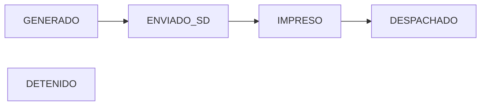

# JD Flow

> Internal Operations Platform developed to streamline dispatch, documentation, auditability, and warehouse coordination workflows.

  <strong>Dispatch • Audit • Documents • Analytics</strong>

Operational Dispatch Management Platform for Warehouse & Distribution Teams

---

## Dashboard

JD Flow centralizes dispatch operations, signed documents, audit trails, OCR search, and operational analytics into a single platform.

---

# Overview

JD Flow is an operational dispatch platform designed to streamline warehouse-to-distribution workflows.

The system centralizes dispatch orders generated from SILA, provides document management, signed package tracking, operational visibility, audit history, OCR-powered document search, and performance analytics in a single interface.

Built to reduce manual communication, eliminate email dependencies, improve traceability, and increase operational efficiency across multiple warehouse locations.

---

# Product Gallery

## Dashboard

Real-time visibility across all warehouse dispatch operations.

---

## Dispatch Order Management

Centralized shipment management, operational workflow control, and document association.

---

## OCR Document Search

Instant document retrieval through indexed PDF content and OCR processing.

---

## Audit Trail

Complete operational traceability and accountability for every action performed in the platform.

---

## System Configuration

Administrative controls for operational thresholds, visibility settings, and workflow configuration.

---

# Dispatch Workflow

JD Flow follows a standardized operational flow:

### Status Definitions

| Status | Description |
|----------|----------|
| GENERADO | Order created and waiting for dispatch review |
| ENVIADO_SD | Sent to San Diego operation |
| IMPRESO | Documentation printed and ready |
| DESPACHADO | Shipment completed |
| DETENIDO | Operational exception requiring attention |

---

# Core Features

### Dispatch Dashboard

- Real-time order monitoring
- Warehouse summaries
- Operational filtering
- Status distribution
- Print queue visibility
- Dispatch workload tracking

### Dispatch Order Management

- Customer information
- Warehouse assignment
- Work Orders (OT)
- Load Orders (ODC)
- Tracking numbers
- Pallet counts
- Operational instructions
- Comments
- Signed package association
- Audit history

### Signed Package Management

- Upload signed package
- Replace package
- View package
- Download package
- Delete package
- Automatic workflow updates

### OCR Search Engine

Search documents by:

- BOL
- Reference Number
- Customer
- Carrier
- Driver
- Trailer
- Address
- Work Order
- OCR extracted content

### Audit Trail

Tracks:

- Status Changes
- Document Uploads
- Document Replacements
- Instruction Updates
- User Actions
- Order Modifications

---

# Multi-Warehouse Support

Designed for operations managing multiple warehouse locations.

Current warehouse structure:

- A - Cross Dock
- B - Cross Dock
- F - Calexico
- G - Airway

The dashboard automatically groups operational metrics by warehouse.

---

# Role-Based Access Control

| Role | Access |
|--------|--------|
| Admin | Full Access |
| Tijuana Operations | Dispatch Management |
| San Diego Warehouse | Operational Updates |
| Read Only | Consultation |

---

# Performance Impact

Measured operational improvements after deployment.

| Metric | Before JD Flow | After JD Flow |
|----------|----------|----------|
| Dispatch Review | Manual | Centralized |
| Document Search | Email Based | OCR Search |
| Audit Tracking | Manual Investigation | Automated |
| Signed Packages | Shared Folders | Direct Association |
| Visibility | Limited | Real Time |

---

# Technology Stack

## Frontend

- React
- TypeScript
- Tailwind CSS

## Backend

- Supabase
- PostgreSQL

## Infrastructure

- Hostinger Horizon
- GitHub

## Integrations

- SILA
- OCR Processing
- Secure File Storage

---

# Security

JD Flow incorporates:

- Role-Based Access Control (RBAC)
- Audit Logging
- Secure Authentication
- Document Access Controls
- Operational Activity Tracking

---

# Future Roadmap

## Phase 2

- KPI Dashboard
- SLA Tracking
- Advanced Analytics
- Customer Portal
- Dispatch Notifications

## Phase 3

- AI Document Classification
- Smart Operational Alerts
- Predictive Dispatch Metrics
- Workflow Automation

---

# Business Value

JD Flow was developed to solve real operational bottlenecks within warehouse and distribution environments.

### Key Outcomes

- Improved dispatch visibility
- Faster document retrieval
- Centralized operational communication
- Enhanced accountability
- Reduced manual workload
- Better operational decision making

---

# Author

**Miguel Soto**

Distribution Operations • Process Automation • Internal Tools Development

---

Built to simplify warehouse dispatch operations.

